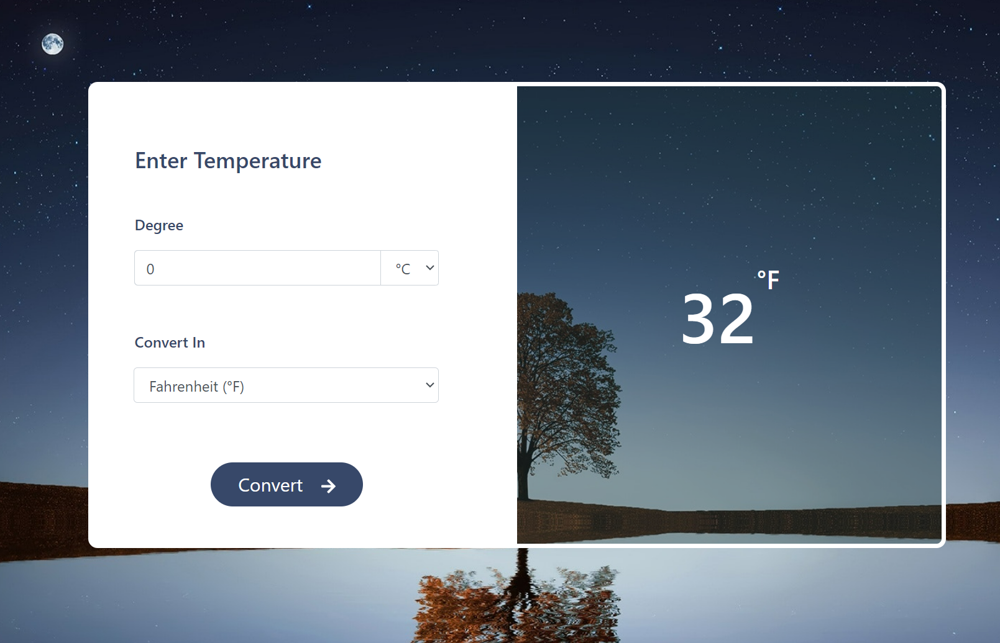

# Temperature Unit Converter

It's a website that converts temperature units from Celsius to Fahrenheit, Kelvin, or vice versa. You have to enter the value and select the output unit type, and the output will be automatically updated as you change the inputs.

